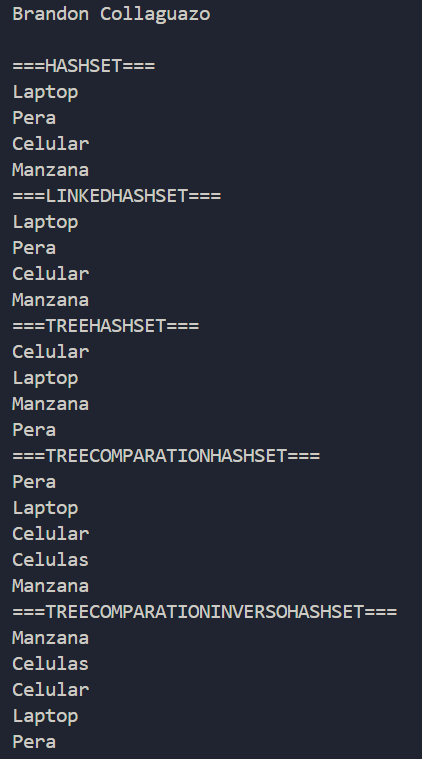

# Práctica Sets

## 📌 Información General

- **Título:** Sets
- **Asignatura:** Estructura de Datos
- **Carrera:** Computación
- **Estudiante:** Brandon Collaguazo
- **Fecha:** 01/07/2025
- **Profesor:** Ing. Pablo Torres

---

## 🛠️ Descripción

Este proyecto demuestra el uso de diferentes tipos de conjuntos (Sets) en Java, incluyendo HashSet, LinkedHashSet y TreeSet, con ejemplos de cómo se comportan y cómo se pueden personalizar con comparadores.

---

## 💡 Características

- HashSet: Demuestra la naturaleza desordenada y sin duplicados de HashSet.
- LinkedHashSet: Muestra cómo LinkedHashSet mantiene el orden de inserción mientras asegura la unicidad.
- TreeSet: Explora el ordenamiento natural de TreeSet y cómo se pueden usar comparadores personalizados.
- Comparadores Personalizados: Ejemplos de TreeSet ordenado por longitud de cadena y luego alfabéticamente, tanto en orden ascendente como descendente.
---

## 🚀 Ejecución

---

