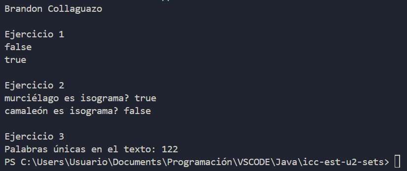

# Práctica SETS - CONTACTO

## 📌 Información General

- **Título:** Sets
- **Asignatura:** Estructura de Datos
- **Carrera:** Computación
- **Estudiante:** Brandon Collaguazo
- **Fecha:** 02/07/2025
- **Profesor:** Ing. Pablo Torres

---

## 🛠️ Descripción

Este proyecto Java explora la implementación y el uso de conjuntos (Sets) para la gestión de datos, con un enfoque particular en TreeSet y comparadores personalizados. Además, incluye una sección de ejercicios prácticos que demuestran la aplicación de Sets para resolver problemas comunes como la detección de duplicados, la verificación de isogramas y el conteo de palabras únicas en un texto.

---

## 💡 Características

**Gestión de Conjuntos (Sets)**
- HashSet: Demostración de la funcionalidad básica de HashSet para almacenar elementos únicos sin orden garantizado.
- TreeSet: Implementación de TreeSet para almacenar elementos de forma ordenada naturalmente.
- TreeSet con Comparadores Personalizados:
- Comparador por Longitud y Alfabético: Ordena cadenas primero por su longitud y luego alfabéticamente.
- Comparador Inverso por Longitud y Alfabético: Ordena cadenas de forma inversa por su longitud y luego alfabéticamente.

---

**Gestión de Contactos con TreeSet**
- Modelo Contacto: Clase que representa un contacto con nombre, apellido y teléfono. Incluye implementaciones de hashCode() y equals() para asegurar la unicidad en los conjuntos.
- ContactoComparator: Un comparador personalizado para Contacto que ordena los contactos alfabéticamente, primero por apellido y luego por nombre.
- ContactoComparatorNumero: Otro comparador personalizado para Contacto que ordena los contactos alfabéticamente por apellido, luego por nombre, y finalmente por número de teléfono en orden descendente.

---

## 🚀 Ejecución

Práctica 1

Práctica 2

Práctica 3

