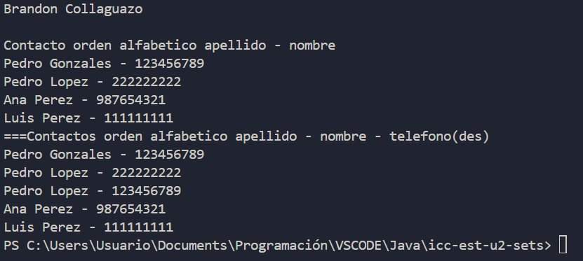

# Práctica SETS - CONTACTO

## 📌 Información General

- **Título:** Sets
- **Asignatura:** Estructura de Datos
- **Carrera:** Computación
- **Estudiante:** Brandon Collaguazo
- **Fecha:** 02/07/2025
- **Profesor:** Ing. Pablo Torres

---

## 🛠️ Descripción

Este proyecto demuestra la implementación y uso de conjuntos (Sets) en Java, específicamente enfocado en la gestión de contactos utilizando `TreeSet` y comparadores personalizados para ordenar los contactos de diversas maneras.

---

## 💡 Características

- **Gestión de Contactos con `TreeSet`**:
    - Se utiliza `TreeSet` para almacenar objetos `Contacto`, asegurando que no haya duplicados y que los contactos se mantengan ordenados.
- **Comparadores Personalizados para `Contacto`**:
    - **`ContactoComparator`**: Ordena los contactos alfabéticamente primero por apellido y luego por nombre.
    - **`ContactoComparatorNumero`**: Ordena los contactos alfabéticamente primero por apellido, luego por nombre, y finalmente por número de teléfono en orden descendente.

---

## 🚀 Ejecución

